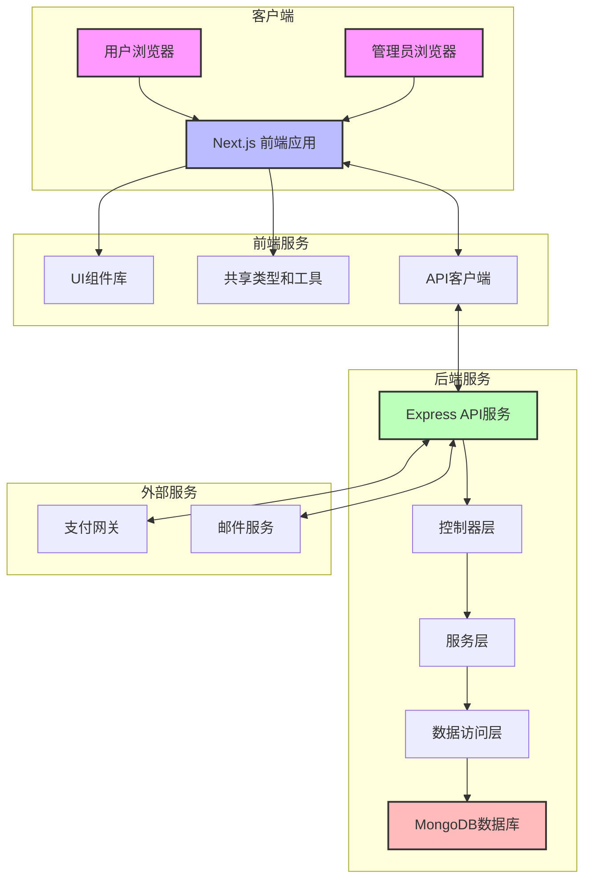
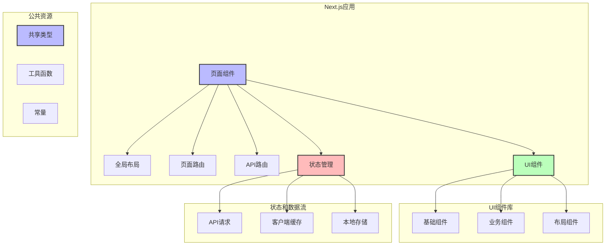
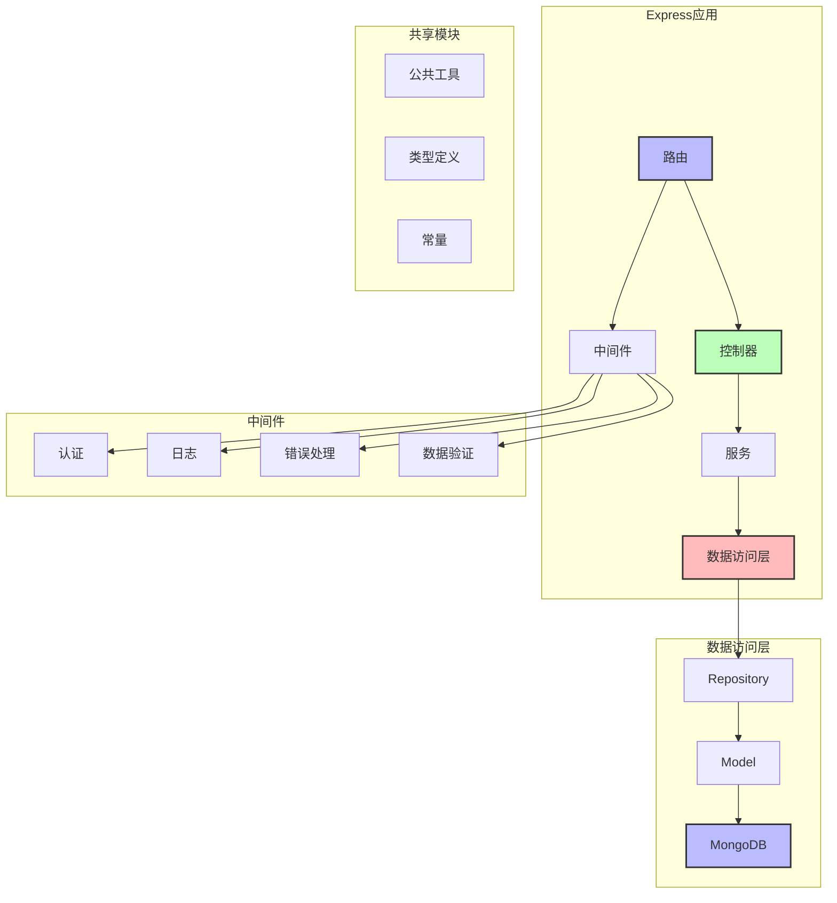
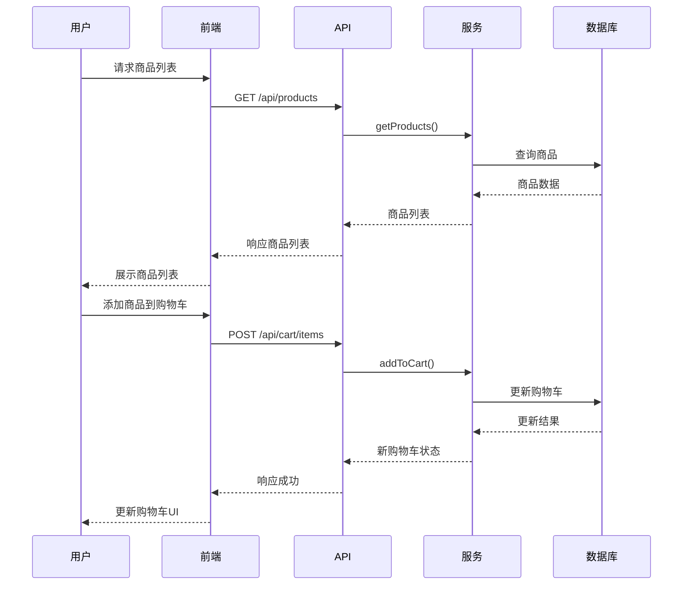
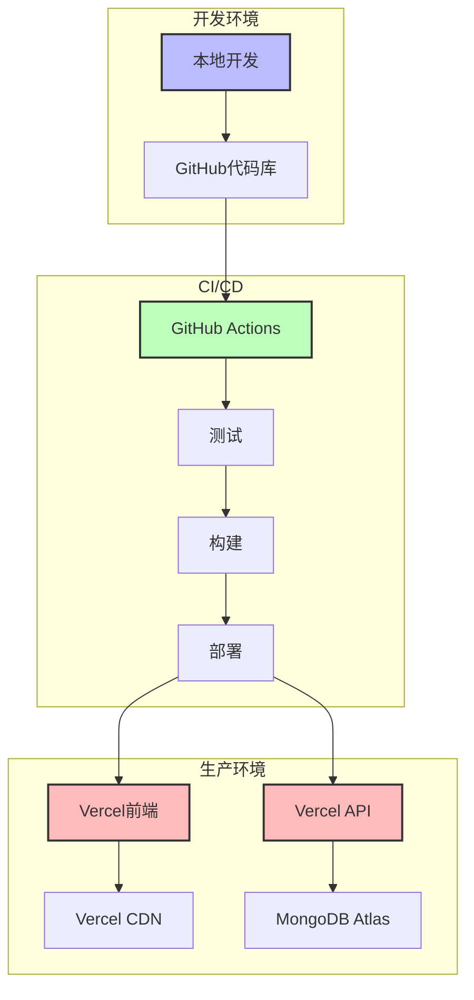

# 购物系统架构设计

## 1. 系统架构概述

购物系统采用现代化的微前端 Monorepo 架构，基于 Turborepo 构建，包含前端应用、后端 API 服务和共享组件库。系统架构设计遵循模块化、可扩展性和高性能原则，使用了最新的 Web 开发技术栈。

## 2. 架构图

### 2.1 系统整体架构

### 2.2 前端架构

### 2.3 后端架构

### 2.4 数据流架构

## 3. 技术栈

### 3.1 前端技术栈

- **框架**: Next.js (React)
- **UI库**: 自定义组件库
- **状态管理**: React Hooks + Context API
- **样式方案**: Tailwind CSS
- **构建工具**: Turborepo + PNPM
- **API通信**: Fetch API / Axios
- **开发环境**: Storybook
- **测试工具**: Vitest / React Testing Library

### 3.2 后端技术栈

- **框架**: Express.js
- **语言**: TypeScript
- **数据库**: MongoDB
- **ODM**: Mongoose
- **认证**: JWT
- **API文档**: Swagger
- **测试**: Jest
- **日志**: Winston

### 3.3 DevOps和基础设施

- **构建和部署**: GitHub Actions + Vercel
- **监控**: Vercel Analytics
- **版本控制**: Git
- **环境管理**: 环境变量 (.env)
- **缓存策略**: Turborepo 远程缓存 + Vercel Edge Network

## 4. 设计原则和模式

### 4.1 架构设计原则

- **关注点分离**: 前端、后端、数据访问层明确分离
- **模块化**: 功能按模块组织，便于独立开发和测试
- **可扩展性**: 设计允许系统在需求增长时轻松扩展
- **可维护性**: 清晰的代码组织和文档支持团队协作
- **性能优化**: 缓存策略、服务器端渲染和代码分割

### 4.2 设计模式

- **MCP(Model-Controller-Provider)模式**: 后端采用MCP模式组织与数据库相关的代码
- **仓库模式**: 数据访问层使用Repository抽象数据操作
- **中间件模式**: Express中间件链处理横切关注点
- **组件化开发**: UI元素封装为可复用组件
- **状态机模式**: 订单状态管理采用状态机模式

## 5. 安全设计

- **认证**: JWT (JSON Web Token) 基于角色的权限控制
- **授权**: 细粒度的API访问控制
- **数据验证**: 客户端和服务器双重验证
- **CSRF保护**: 跨站请求伪造防护措施
- **密码安全**: bcrypt 哈希 + 盐存储
- **敏感数据保护**: HTTPS传输 + 数据加密
- **安全头部**: 设置安全相关的HTTP头部

## 6. 扩展性和可伸缩性

### 6.1 水平扩展策略

- **无状态API**: 便于部署多个实例
- **数据库索引优化**: 提高查询性能
- **连接池管理**: 有效管理数据库连接
- **缓存策略**: 减轻数据库负载

### 6.2 功能扩展

- **插件架构**: 允许通过插件添加新功能
- **API版本控制**: 支持API平滑演进
- **特性标志**: 可控制功能的渐进式发布

## 7. 部署架构

## 8. 系统依赖和集成点

- **核心依赖**:

  - MongoDB: 存储所有业务数据
  - Vercel: 用于部署和托管
  - GitHub: 代码仓库和CI/CD

- **外部集成**:
  - 支付网关: 支付处理
  - 电子邮件服务: 通知和营销
  - 分析服务: 用户行为跟踪
