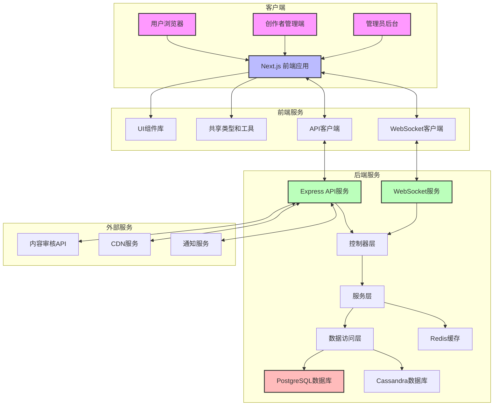
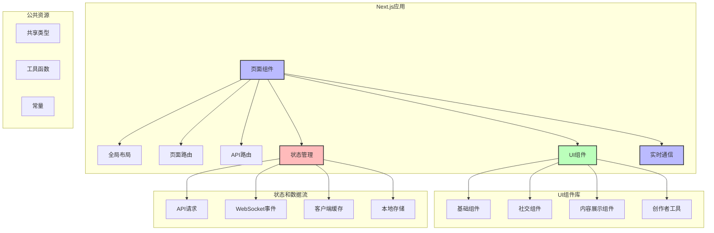
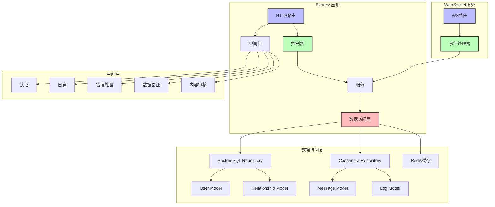
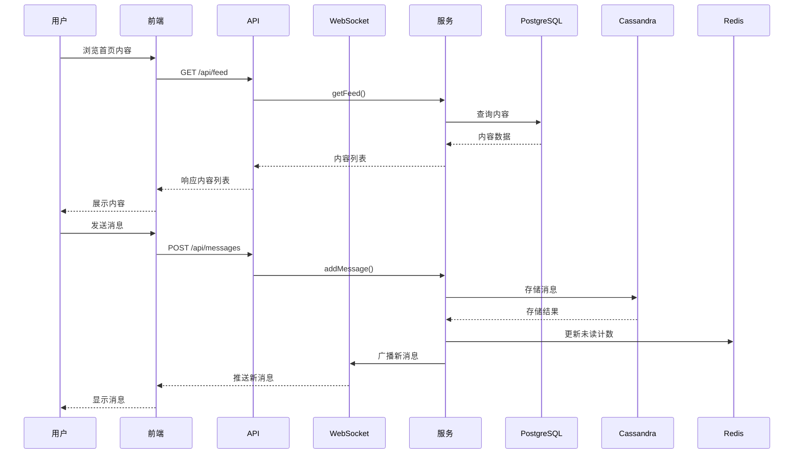
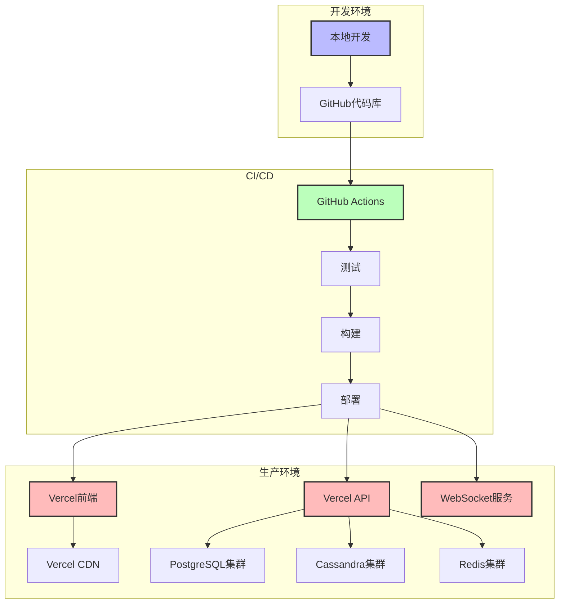

# 社交媒体系统架构设计

## 1. 系统架构概述

社交媒体系统采用现代化的微前端 Monorepo 架构，基于 Turborepo 构建，包含前端应用、后端 API 服务和共享组件库。系统设计专注于高并发实时交互、内容管理和个性化推荐，使用了最新的 Web 开发技术栈。

### 1.1 C4模型概述

系统采用C4模型进行架构描述，包含以下视图：

- **系统上下文图**：展示系统与外部用户和系统的交互关系
- **容器图**：展示系统的主要技术组件和交互方式
- **组件图**：展示各容器内部的组件结构和关系


## 2. 架构图

### 2.1 C4上下文图

```plantuml
!include ../c4-context.puml
```

### 2.2 C4容器图

```plantuml
!include ../c4-container.puml
```

### 2.3 C4组件图

```plantuml
!include ../c4-component.puml
```

### 2.4 系统整体架构



### 2.5 前端架构



### 2.6 后端架构



### 2.7 数据流架构



## 3. 技术栈

### 3.1 新增功能支持

- **短视频(Reels)功能**：

  - 支持15-60秒短视频上传和播放
  - 基于FFmpeg的转码处理
  - 互动功能(点赞、评论、分享)
  - 个性化推荐算法

- **增强分析功能**：
  - 内容表现分析
  - 用户行为追踪
  - 实时数据看板

### 3.2 前端技术栈

- **框架**: Next.js (React)
- **UI库**: 自定义组件库 + Tailwind CSS
- **状态管理**: Zustand + React Query
- **实时通信**: WebSocket
- **构建工具**: Turborepo + PNPM
- **API通信**: Fetch API / Axios
- **开发环境**: Storybook
- **测试工具**: Vitest / React Testing Library

### 3.3 后端技术栈

新增服务支持：

- **短视频服务**：处理视频上传、转码和分发
- **互动服务**：处理点赞、收藏、分享等互动行为
- **分析服务**：收集和处理用户行为数据

- **框架**: Express.js + WebSocket
- **语言**: TypeScript
- **数据库**:
  - PostgreSQL: 核心关系型数据(用户信息、关系)
  - Redis: 实时缓存(会话、计数器)
  - Cassandra: 高写入场景(消息、日志)
- **ORM/ODM**:
  - TypeORM (PostgreSQL)
  - Redis Client
  - Cassandra Driver
- **认证**: JWT + OAuth2
- **API文档**: Swagger
- **测试**: Jest + Supertest
- **日志**: Winston + ELK

### 3.4 DevOps和基础设施

新增基础设施：

- **视频处理集群**：用于视频转码和处理
- **分析数据管道**：实时处理用户行为数据

- **容器化**: Docker + Kubernetes
- **构建和部署**: GitHub Actions + Vercel + Docker Hub
- **监控**: Prometheus + Grafana + Docker Stats
- **版本控制**: Git
- **环境管理**: Docker Compose + 环境变量 (.env)
- **缓存策略**: Redis + Vercel Edge Network
- **CDN**: 用于媒体内容分发
- **编排工具**: Kubernetes集群管理

## 4. 设计原则和模式

### 4.1 架构设计原则

- **实时优先**: WebSocket支持即时互动
- **内容为中心**: 优化内容管理和分发
- **可扩展性**: 设计支持高并发社交互动
- **模块化**: 功能按模块组织，便于独立开发
- **性能优化**: 缓存策略、CDN和代码分割

### 4.2 设计模式

- **CQRS模式**: 读写分离优化性能
- **事件驱动**: 实时通知和互动
- **仓库模式**: 数据访问层抽象
- **中间件模式**: 处理横切关注点
- **组件化开发**: UI元素高度复用
- **观察者模式**: 实现实时更新

## 5. 安全设计

- **认证**: JWT + 双因素认证
- **授权**: 基于角色的细粒度控制
- **内容安全**: 自动+人工审核流程
- **数据验证**: 多层验证机制
- **CSRF保护**: 防护措施
- **密码安全**: bcrypt 哈希 + 盐存储
- **敏感数据保护**: HTTPS + 加密
- **安全头部**: 安全相关的HTTP头部

## 6. 扩展性和可伸缩性

### 6.1 水平扩展策略

- **无状态API**: 易于扩展
- **数据库分片**: 支持大数据量
- **连接池管理**: 高效资源利用
- **缓存策略**: Redis减轻数据库负载
- **消息队列**: 异步处理高负载操作

### 6.2 功能扩展

- **插件架构**: 支持功能扩展
- **API版本控制**: 平滑演进
- **特性标志**: 渐进式发布
- **AB测试**: 功能实验框架

## 7. 部署架构



## 8. 技术愿景

我们致力于构建一个技术先进、可扩展的系统：

- **前沿技术栈**：采用React、Next.js、Express和PostgreSQL等现代技术
- **容器化架构**：基于Docker和Kubernetes的容器化部署
- **可扩展架构**：基于微服务思想设计的模块化结构
- **实时交互**：WebSocket支持实时消息和通知
- **视频处理**：基于FFmpeg的高效视频转码和处理能力
- **性能优先**：优化加载时间、响应速度和资源利用
- **安全至上**：遵循行业最佳安全实践和标准
- **数据分析**：实时处理用户行为数据

## 9. 系统依赖和集成点

- **核心依赖**:

  - PostgreSQL: 核心关系型数据存储
  - Cassandra: 高写入场景数据存储
  - Redis: 缓存和实时功能
  - Vercel: 部署和托管
  - GitHub: 代码仓库和CI/CD
  - Docker: 容器化运行环境
  - Kubernetes: 容器编排管理

- **外部集成**:
  - 内容审核服务: 自动内容审核
  - CDN服务: 媒体内容分发
  - 通知服务: 推送通知
  - 分析服务: 用户行为分析
