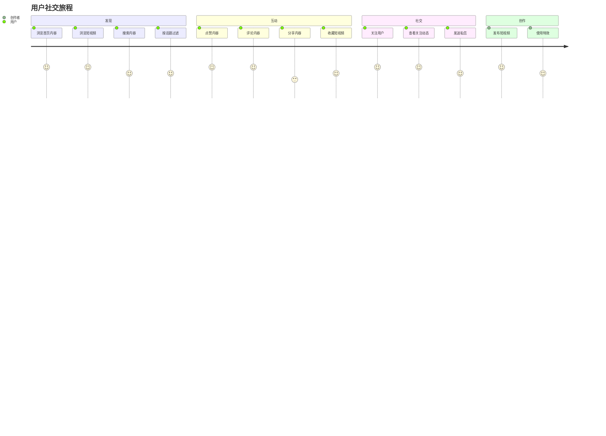

# 社交媒体系统用户故事地图

## 用户角色

### 普通用户

在系统中浏览内容、互动和社交的用户

### 内容创作者

在系统中发布高质量内容并管理粉丝的用户

### 管理员

负责管理内容、用户和系统的管理者

## 用户旅程与故事

### 1. 用户认证与授权

#### 普通用户故事

| 故事ID | 用户故事                         | 优先级 | 验收标准                                          |
| ------ | -------------------------------- | ------ | ------------------------------------------------- |
| US-101 | 作为用户，我希望能够注册账户     | 高     | 提供基本信息注册，验证有效性，注册成功重定向首页  |
| US-102 | 作为用户，我希望能够登录系统     | 高     | 使用邮箱/用户名密码登录，验证凭据，显示个人化内容 |
| US-103 | 作为用户，我希望能够重置密码     | 中     | 请求重置链接到邮箱，通过链接设置新密码            |
| US-104 | 作为用户，我希望能够编辑个人资料 | 中     | 查看和编辑个人信息，系统确认更新成功              |

#### 内容创作者故事

| 故事ID | 用户故事                       | 优先级 | 验收标准                                   |
| ------ | ------------------------------ | ------ | ------------------------------------------ |
| US-105 | 作为创作者，我希望能够申请认证 | 中     | 提交认证申请，系统审核，通过后显示认证标识 |

#### 管理员故事

| 故事ID | 用户故事                             | 优先级 | 验收标准                                 |
| ------ | ------------------------------------ | ------ | ---------------------------------------- |
| US-106 | 作为管理员，我希望能够登录后台       | 高     | 专用凭据登录，验证权限，显示管理控制台   |
| US-107 | 作为管理员，我希望能够管理用户权限   | 中     | 查看用户列表，修改角色权限，记录变更历史 |
| US-108 | 作为管理员，我希望能够审核创作者认证 | 中     | 查看待审核申请，批准/拒绝，通知申请人    |

### 2. 内容浏览与互动

#### 普通用户故事

| 故事ID | 用户故事                           | 优先级 | 验收标准                               |
| ------ | ---------------------------------- | ------ | -------------------------------------- |
| US-201 | 作为用户，我希望能够浏览首页内容   | 高     | 展示关注用户帖子，多页浏览，显示互动数 |
| US-202 | 作为用户，我希望能够按话题过滤内容 | 高     | 提供话题标签，选择话题，显示相关内容   |
| US-203 | 作为用户，我希望能够搜索内容       | 中     | 提供搜索框，输入关键词，显示匹配结果   |
| US-204 | 作为用户，我希望能够查看内容详情   | 高     | 显示完整内容、评论和互动选项           |
| US-205 | 作为用户，我希望能够点赞内容       | 高     | 记录点赞状态，显示点赞总数             |
| US-206 | 作为用户，我希望能够评论内容       | 高     | 发表评论，保存评论，其他用户可见       |
| US-207 | 作为用户，我希望能够分享内容       | 中     | 分享到其他平台，记录分享次数           |
| US-208 | 作为用户，我希望能够浏览短视频     | 高     | 全屏播放，上下滑动切换，显示互动选项   |
| US-209 | 作为用户，我希望能够收藏短视频     | 中     | 保存到收藏夹，方便后续查看             |

#### 内容创作者故事

| 故事ID | 用户故事                             | 优先级 | 验收标准                                 |
| ------ | ------------------------------------ | ------ | ---------------------------------------- |
| US-210 | 作为创作者，我希望能够查看内容数据   | 中     | 查看互动统计，显示浏览量、点赞数，可导出 |
| US-211 | 作为创作者，我希望能够查看短视频数据 | 中     | 查看播放量、完播率等详细指标             |

#### 内容创作者故事

| 故事ID | 用户故事                           | 优先级 | 验收标准                                 |
| ------ | ---------------------------------- | ------ | ---------------------------------------- |
| US-208 | 作为创作者，我希望能够查看内容数据 | 中     | 查看互动统计，显示浏览量、点赞数，可导出 |

### 3. 内容创作

#### 内容创作者故事

| 故事ID | 用户故事                             | 优先级 | 验收标准                                   |
| ------ | ------------------------------------ | ------ | ------------------------------------------ |
| US-301 | 作为创作者，我希望能够发布新内容     | 高     | 创建新内容，支持多种格式，发布后显示在主页 |
| US-302 | 作为创作者，我希望能够编辑内容       | 高     | 修改已发布内容，保存编辑历史，实时更新     |
| US-303 | 作为创作者，我希望能够删除内容       | 中     | 删除内容，请求确认，从系统移除             |
| US-304 | 作为创作者，我希望能够管理标签       | 中     | 添加/编辑标签，系统推荐相关内容            |
| US-305 | 作为创作者，我希望能够发布短视频     | 高     | 上传15-60秒视频，添加描述和标签            |
| US-306 | 作为创作者，我希望能够编辑短视频     | 中     | 修改视频描述、标签和封面                   |
| US-307 | 作为创作者，我希望能够使用短视频特效 | 中     | 应用滤镜、音乐和特效                       |

### 4. 社交互动

#### 普通用户故事

| 故事ID | 用户故事                         | 优先级 | 验收标准                             |
| ------ | -------------------------------- | ------ | ------------------------------------ |
| US-401 | 作为用户，我希望能够关注其他用户 | 高     | 关注用户，更新关注列表，显示关注状态 |
| US-402 | 作为用户，我希望能够查看关注动态 | 高     | 展示关注用户最新内容，按时间排序     |
| US-403 | 作为用户，我希望能够发送私信     | 中     | 与其他用户私信，实时消息通知         |

### 5. 通知系统

#### 普通用户故事

| 故事ID | 用户故事                         | 优先级 | 验收标准                 |
| ------ | -------------------------------- | ------ | ------------------------ |
| US-501 | 作为用户，我希望能够接收互动通知 | 高     | 点赞、评论等互动实时通知 |
| US-502 | 作为用户，我希望能够管理通知设置 | 中     | 自定义通知类型和频率     |

## 产品地图

## 发布计划

### MVP (最小可行产品)

- 用户注册和登录 (US-101, US-102)
- 基础内容浏览 (US-201, US-204)
- 内容互动 (US-205, US-206)
- 内容发布 (US-301)
- 短视频浏览 (US-208)

### 第二阶段发布

- 高级内容发现 (US-202, US-203)
- 社交功能 (US-401, US-402)
- 通知系统 (US-501)
- 短视频创作 (US-305)

### 第三阶段发布

- 创作者工具 (US-105, US-210, US-211, US-304)
- 私信功能 (US-403)
- 通知管理 (US-502)
- 短视频特效 (US-307)
