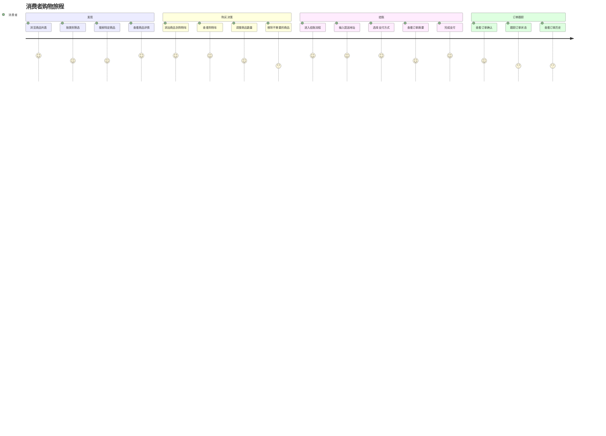
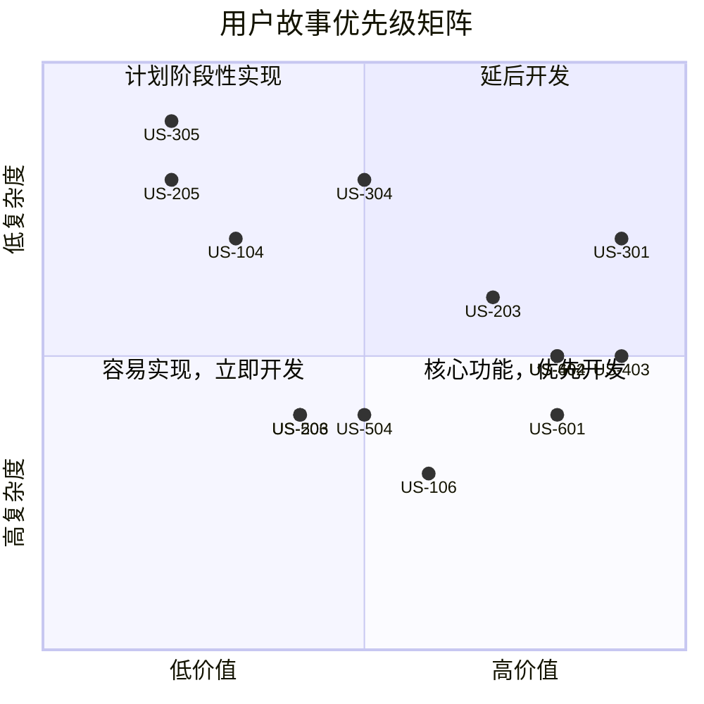

# 购物系统用户故事地图

## 用户角色

### 消费者

在系统中浏览和购买商品的最终用户

### 管理员

负责管理商品、订单和用户的系统管理者

## 用户旅程与故事

### 1. 用户认证与授权

#### 消费者故事

| 故事ID | 用户故事                                                     | 优先级 | 验收标准                                                                        |
| ------ | ------------------------------------------------------------ | ------ | ------------------------------------------------------------------------------- |
| US-101 | 作为消费者，我希望能够注册账户，以便可以开始购物             | 高     | 用户可以提供基本信息注册新账户；系统验证信息有效性；成功注册后重定向到首页      |
| US-102 | 作为消费者，我希望能够登录系统，以便访问我的账户信息         | 高     | 用户可以使用邮箱/用户名和密码登录；系统验证凭据正确性；登录成功后显示个人化内容 |
| US-103 | 作为消费者，我希望能够重置密码，以便在忘记密码时恢复账户访问 | 中     | 用户可以请求密码重置；系统发送重置链接到注册邮箱；用户可以通过链接设置新密码    |
| US-104 | 作为消费者，我希望能够查看和编辑个人资料，以便保持信息最新   | 低     | 用户可以查看当前个人信息；用户可以编辑并保存个人信息；系统确认更新成功          |

#### 管理员故事

| 故事ID | 用户故事                                             | 优先级 | 验收标准                                                                 |
| ------ | ---------------------------------------------------- | ------ | ------------------------------------------------------------------------ |
| US-105 | 作为管理员，我希望能够登录管理后台，以便管理系统     | 高     | 管理员可以使用专用凭据登录；系统验证管理员权限；成功后显示管理控制台     |
| US-106 | 作为管理员，我希望能够管理用户权限，以便控制系统访问 | 中     | 管理员可以查看所有用户列表；可以修改用户角色和权限；系统记录权限变更历史 |

### 2. 商品浏览与搜索

#### 消费者故事

| 故事ID | 用户故事                                                       | 优先级 | 验收标准                                                               |
| ------ | -------------------------------------------------------------- | ------ | ---------------------------------------------------------------------- |
| US-201 | 作为消费者，我希望能够浏览所有商品，以便找到我感兴趣的商品     | 高     | 首页展示商品列表；用户可以浏览多页商品；商品显示基本信息和图片         |
| US-202 | 作为消费者，我希望能够按类别过滤商品，以便更快找到特定商品     | 高     | 系统提供商品分类菜单；用户可以选择特定类别；系统显示该类别下的所有商品 |
| US-203 | 作为消费者，我希望能够搜索商品，以便直接找到我想要的商品       | 中     | 系统提供搜索框；用户可以输入关键词搜索；系统显示匹配的商品结果         |
| US-204 | 作为消费者，我希望能够查看商品详情，以便了解更多商品信息       | 高     | 用户可以点击商品进入详情页；详情页显示完整产品信息、规格和库存状态     |
| US-205 | 作为消费者，我希望能够根据价格排序商品，以便找到符合预算的商品 | 低     | 系统提供价格排序选项；用户可以选择升序或降序；系统按选择排序显示商品   |

#### 管理员故事

| 故事ID | 用户故事                                                 | 优先级 | 验收标准                                                       |
| ------ | -------------------------------------------------------- | ------ | -------------------------------------------------------------- |
| US-206 | 作为管理员，我希望能够查看商品浏览数据，以便分析热门商品 | 低     | 管理员可以查看商品浏览统计；系统显示浏览量排名；可导出数据报告 |

### 3. 购物车管理

#### 消费者故事

| 故事ID | 用户故事                                                       | 优先级 | 验收标准                                                                 |
| ------ | -------------------------------------------------------------- | ------ | ------------------------------------------------------------------------ |
| US-301 | 作为消费者，我希望能够将商品添加到购物车，以便之后购买         | 高     | 用户可以从商品列表或详情页添加商品；系统确认添加成功；购物车图标更新数量 |
| US-302 | 作为消费者，我希望能够查看购物车内容，以便确认将要购买的商品   | 高     | 用户可以访问购物车页面；系统显示所有已添加商品、数量和小计               |
| US-303 | 作为消费者，我希望能够调整购物车中商品数量，以便根据需求调整   | 高     | 用户可以增加或减少商品数量；系统实时更新总价；数量不能少于1              |
| US-304 | 作为消费者，我希望能够从购物车移除商品，以便取消不想购买的商品 | 中     | 用户可以点击移除按钮；系统请求确认；确认后从购物车中删除商品             |
| US-305 | 作为消费者，我希望能够清空购物车，以便一次性移除所有商品       | 低     | 用户可以点击清空购物车按钮；系统请求确认；确认后清空所有商品             |

### 4. 结账与支付

#### 消费者故事

| 故事ID | 用户故事                                                     | 优先级 | 验收标准                                                                 |
| ------ | ------------------------------------------------------------ | ------ | ------------------------------------------------------------------------ |
| US-401 | 作为消费者，我希望能够从购物车进入结账流程，以便完成购买     | 高     | 用户可以点击结账按钮；系统验证购物车有商品；用户被引导至结账页面         |
| US-402 | 作为消费者，我希望能够输入配送地址，以便商品能被送到正确地点 | 高     | 结账页面提供地址输入表单；系统验证地址完整性；用户可以保存地址供将来使用 |
| US-403 | 作为消费者，我希望能够选择支付方式，以便使用首选方式支付     | 高     | 系统展示可用支付方式；用户可以选择支付方法；系统验证支付方式有效性       |
| US-404 | 作为消费者，我希望能够查看订单摘要，以便确认订单细节         | 中     | 结账前显示完整订单摘要；包括商品、价格、配送费和总额；用户可以返回修改   |
| US-405 | 作为消费者，我希望能够完成支付，以便确认订单                 | 高     | 用户可以输入支付信息；系统安全处理支付；成功后显示确认页面               |

### 5. 订单管理

#### 消费者故事

| 故事ID | 用户故事                                                   | 优先级 | 验收标准                                                         |
| ------ | ---------------------------------------------------------- | ------ | ---------------------------------------------------------------- |
| US-501 | 作为消费者，我希望能够查看订单历史，以便跟踪过去的购买     | 中     | 用户可以访问订单历史页面；系统显示所有过去订单；可以按时间排序   |
| US-502 | 作为消费者，我希望能够查看订单详情，以便了解特定订单信息   | 中     | 用户可以查看单个订单详情；系统显示商品、价格、状态和配送信息     |
| US-503 | 作为消费者，我希望能够取消未发货订单，以便在改变主意时退款 | 低     | 用户可以取消符合条件的订单；系统请求确认；确认后更新订单状态     |
| US-504 | 作为消费者，我希望能够跟踪订单状态，以便知道订单处理进度   | 低     | 用户可以查看订单当前状态；系统显示状态更新历史；提供预计到达时间 |

#### 管理员故事

| 故事ID | 用户故事                                             | 优先级 | 验收标准                                                                 |
| ------ | ---------------------------------------------------- | ------ | ------------------------------------------------------------------------ |
| US-505 | 作为管理员，我希望能够查看所有订单，以便监控销售情况 | 高     | 管理员可以访问订单管理页面；系统显示所有订单；提供过滤和搜索功能         |
| US-506 | 作为管理员，我希望能够更新订单状态，以便反映处理进度 | 高     | 管理员可以选择订单并更新状态；系统保存状态变更；通知相关用户             |
| US-507 | 作为管理员，我希望能够查看订单统计，以便分析销售趋势 | 中     | 管理员可以查看销售报告；系统显示时间段内的订单数量和金额；提供图表可视化 |

### 6. 商品管理

#### 管理员故事

| 故事ID | 用户故事                                                 | 优先级 | 验收标准                                                                       |
| ------ | -------------------------------------------------------- | ------ | ------------------------------------------------------------------------------ |
| US-601 | 作为管理员，我希望能够添加新商品，以便扩展商品目录       | 高     | 管理员可以填写商品信息表单；支持上传商品图片；成功添加后可立即上线或保存为草稿 |
| US-602 | 作为管理员，我希望能够编辑现有商品，以便更新商品信息     | 高     | 管理员可以修改商品所有属性；系统保存修改历史；更新后实时反映在前台             |
| US-603 | 作为管理员，我希望能够下架商品，以便移除不再销售的商品   | 中     | 管理员可以将商品标记为下架；系统确认操作；下架商品不在前台显示                 |
| US-604 | 作为管理员，我希望能够管理商品库存，以便反映实际库存情况 | 高     | 管理员可以更新库存数量；系统记录库存变更历史；库存低时发出警告                 |
| US-605 | 作为管理员，我希望能够管理商品分类，以便更好组织商品     | 中     | 管理员可以创建、编辑和删除分类；可以将商品分配到不同分类；支持多层分类结构     |

## 产品地图

## 故事优先级矩阵

## 发布计划

### MVP (最小可行产品)

- 用户注册和登录 (US-101, US-102)
- 基础商品浏览和查看 (US-201, US-204)
- 购物车基本功能 (US-301, US-302, US-303)
- 简单结账流程 (US-401, US-402, US-403, US-405)
- 基本商品管理 (US-601, US-602, US-604)

### 第二阶段发布

- 密码管理和个人资料 (US-103, US-104)
- 增强的商品搜索和筛选 (US-203, US-205)
- 订单历史和详情 (US-501, US-502)
- 管理员订单处理功能 (US-505, US-506)

### 第三阶段发布

- 高级权限管理 (US-106)
- 商品浏览分析 (US-206)
- 订单取消和跟踪 (US-503, US-504)
- 订单统计分析 (US-507)
- 高级商品管理 (US-603, US-605)
