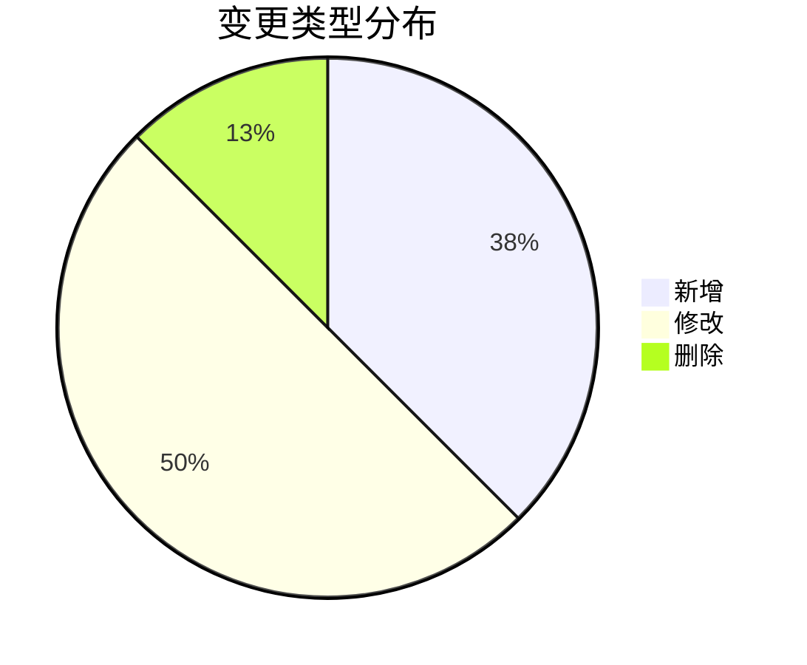
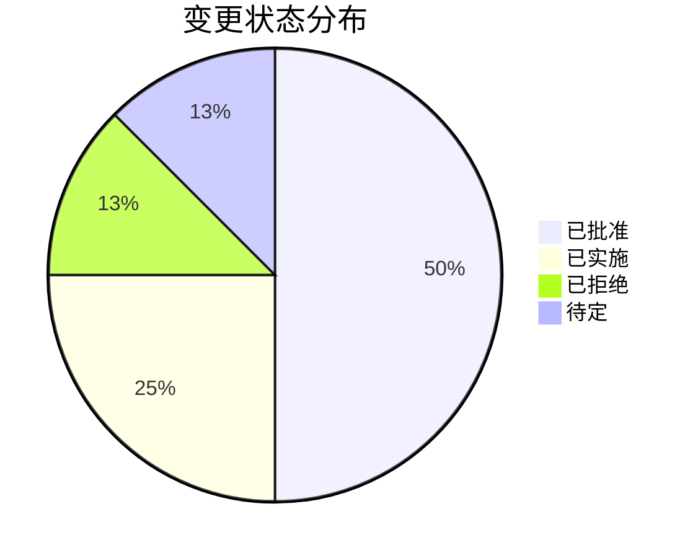

# 购物系统需求变更日志

本文档记录了购物系统开发过程中的需求变更历史，包括添加的新需求、修改的现有需求以及移除的需求。

## 变更日志格式

每个变更记录包含以下信息：

- **变更ID**：唯一标识符
- **变更日期**：变更提出的日期
- **状态**：已批准、已实施、已拒绝、待定
- **变更类型**：新增、修改、删除
- **相关用户故事**：受影响的用户故事ID
- **提出人**：变更提出者
- **优先级**：高、中、低
- **描述**：变更的详细描述
- **理由**：变更的理由或业务驱动因素
- **影响评估**：变更对系统设计、开发计划和其他方面的影响

## 变更记录

### CL-001: 添加社交媒体登录功能

| 项目         | 详情                                                                                                        |
| ------------ | ----------------------------------------------------------------------------------------------------------- |
| 变更ID       | CL-001                                                                                                      |
| 变更日期     | 2023-10-15                                                                                                  |
| 状态         | 已批准                                                                                                      |
| 变更类型     | 新增                                                                                                        |
| 相关用户故事 | US-101, US-102                                                                                              |
| 提出人       | 产品经理                                                                                                    |
| 优先级       | 中                                                                                                          |
| 描述         | 添加使用Google、Facebook和Twitter账户登录的功能，允许用户使用现有社交媒体账户快速注册和登录系统             |
| 理由         | 简化用户注册和登录流程，提高转化率和用户体验                                                                |
| 影响评估     | - 需要添加OAuth2集成 - 用户模型需要修改以支持第三方认证 - 需要更新认证流程和UI - 估计开发时间：2周 |

### CL-002: 修改商品评价系统

| 项目         | 详情                                                                                                                |
| ------------ | ------------------------------------------------------------------------------------------------------------------- |
| 变更ID       | CL-002                                                                                                              |
| 变更日期     | 2023-11-03                                                                                                          |
| 状态         | 已实施                                                                                                              |
| 变更类型     | 修改                                                                                                                |
| 相关用户故事 | 新用户故事                                                                                                          |
| 提出人       | UX设计师                                                                                                            |
| 优先级       | 高                                                                                                                  |
| 描述         | 添加商品评价和评论功能，允许用户对已购买商品进行星级评价(1-5星)和文字评论，并支持上传图片                           |
| 理由         | 增强用户信任度，提供真实产品使用反馈，帮助其他用户做出购买决策                                                      |
| 影响评估     | - 需要创建新的数据模型用于评价 - 需要修改产品详情页面以显示评价 - 需要添加评价管理功能 - 估计开发时间：3周 |

### CL-003: 取消多语言支持

| 项目         | 详情                                                                               |
| ------------ | ---------------------------------------------------------------------------------- |
| 变更ID       | CL-003                                                                             |
| 变更日期     | 2023-12-05                                                                         |
| 状态         | 已批准                                                                             |
| 变更类型     | 删除                                                                               |
| 相关用户故事 | 无（计划中功能）                                                                   |
| 提出人       | 项目经理                                                                           |
| 优先级       | 低                                                                                 |
| 描述         | 移除原计划中的多语言支持功能，将只支持简体中文                                     |
| 理由         | 由于资源限制和当前市场重点在国内，决定优先开发其他功能，将多语言支持推迟到未来版本 |
| 影响评估     | - 简化UI开发 - 减少翻译和本地化工作 - 预计节省开发时间：4周                  |

### CL-004: 添加推荐系统

| 项目         | 详情                                                                                                                                  |
| ------------ | ------------------------------------------------------------------------------------------------------------------------------------- |
| 变更ID       | CL-004                                                                                                                                |
| 变更日期     | 2024-01-10                                                                                                                            |
| 状态         | 待定                                                                                                                                  |
| 变更类型     | 新增                                                                                                                                  |
| 相关用户故事 | US-201                                                                                                                                |
| 提出人       | 数据科学团队                                                                                                                          |
| 优先级       | 中                                                                                                                                    |
| 描述         | 实现基于机器学习的商品推荐系统，根据用户浏览历史、购买行为和类似用户偏好推荐商品                                                      |
| 理由         | 提高用户参与度、增加购买率和平均订单金额                                                                                              |
| 影响评估     | - 需要构建用户行为数据收集系统 - 需要开发推荐算法 - 需要修改前端以展示推荐商品 - 估计开发时间：8周 - 需要额外的服务器资源 |

### CL-005: 修改购物车保存期限

| 项目         | 详情                                                                                                            |
| ------------ | --------------------------------------------------------------------------------------------------------------- |
| 变更ID       | CL-005                                                                                                          |
| 变更日期     | 2024-02-15                                                                                                      |
| 状态         | 已实施                                                                                                          |
| 变更类型     | 修改                                                                                                            |
| 相关用户故事 | US-301, US-302                                                                                                  |
| 提出人       | 市场团队                                                                                                        |
| 优先级       | 高                                                                                                              |
| 描述         | 将未登录用户购物车保存期限从3天延长到30天，已登录用户购物车从原来的60天延长到无限期                             |
| 理由         | 用户反馈表明当前购物车保存期限过短，影响购物体验和转化率                                                        |
| 影响评估     | - 需要修改购物车数据存储策略 - 需要更新Cookie政策和隐私声明 - 需要调整数据清理脚本 - 估计开发时间：1周 |

### CL-006: 添加批量购买折扣

| 项目         | 详情                                                                                                                                |
| ------------ | ----------------------------------------------------------------------------------------------------------------------------------- |
| 变更ID       | CL-006                                                                                                                              |
| 变更日期     | 2024-03-01                                                                                                                          |
| 状态         | 已批准                                                                                                                              |
| 变更类型     | 新增                                                                                                                                |
| 相关用户故事 | US-301, US-302, US-404                                                                                                              |
| 提出人       | 销售总监                                                                                                                            |
| 优先级       | 中                                                                                                                                  |
| 描述         | 实现批量购买折扣功能，允许设置"买X件打Y折"或"满X元减Y元"等促销规则                                                                  |
| 理由         | 鼓励用户增加购买数量，提高平均订单金额                                                                                              |
| 影响评估     | - 需要创建促销规则管理模块 - 需要修改购物车和结算逻辑 - 需要更新订单计算系统 - 需要调整订单显示方式 - 估计开发时间：4周 |

### CL-007: 延迟发票管理功能

| 项目         | 详情                                                                            |
| ------------ | ------------------------------------------------------------------------------- |
| 变更ID       | CL-007                                                                          |
| 变更日期     | 2024-03-15                                                                      |
| 状态         | 已拒绝                                                                          |
| 变更类型     | 修改                                                                            |
| 相关用户故事 | 无（计划中功能）                                                                |
| 提出人       | 项目经理                                                                        |
| 优先级       | 低                                                                              |
| 描述         | 将原计划中的电子发票自动生成和管理功能推迟到下一个主要版本                      |
| 理由         | 当前阶段的重点是核心购物功能，发票管理可以在后续版本中实现                      |
| 影响评估     | - 简化当前系统开发 - 预计节省开发时间：3周 - 可能需要临时手动处理发票请求 |

### CL-008: 增加多收货地址支持

| 项目         | 详情                                                                                          |
| ------------ | --------------------------------------------------------------------------------------------- |
| 变更ID       | CL-008                                                                                        |
| 变更日期     | 2024-04-10                                                                                    |
| 状态         | 已批准                                                                                        |
| 变更类型     | 修改                                                                                          |
| 相关用户故事 | US-402                                                                                        |
| 提出人       | 用户体验团队                                                                                  |
| 优先级       | 高                                                                                            |
| 描述         | 修改原有单一收货地址设计，支持用户保存和管理多个收货地址，并在结账时选择                      |
| 理由         | 用户反馈显示多收货地址是高需求功能，可提高购物便捷性                                          |
| 影响评估     | - 需要修改用户数据模型 - 需要创建地址管理界面 - 需要更新结账流程 - 估计开发时间：2周 |

## 变更分析

### 变更趋势

### 变更影响评估

总体项目时间影响：

- 新增开发时间：约17周
- 节省开发时间：约7周
- 净增加开发时间：约10周

主要受影响的模块：

1. 用户认证系统
2. 商品展示和推荐
3. 购物车管理
4. 订单处理和结算
5. 数据分析
