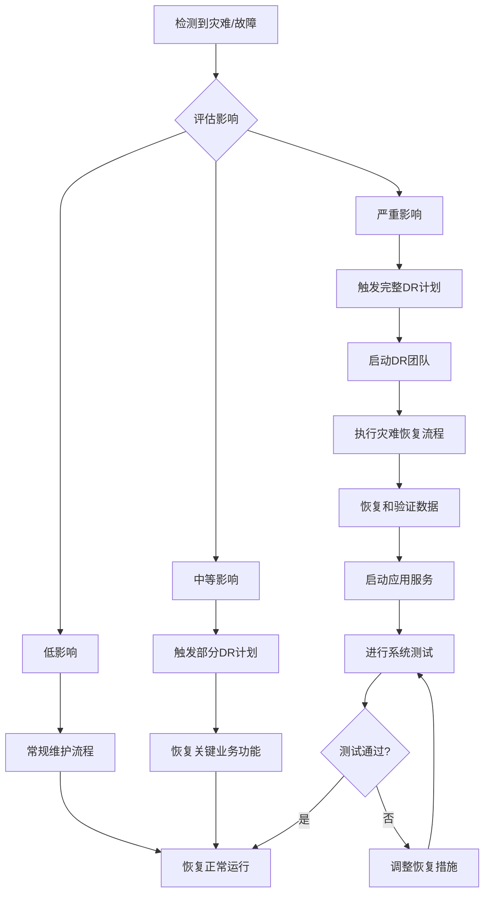

# 购物系统灾难恢复计划

本文档详细描述了购物系统的灾难恢复(DR)策略、程序和技术措施，旨在确保系统在发生重大事故或灾难后能够快速恢复运行。

## 1. 目标与范围

### 1.1 目标

- 确保在发生灾难时能够尽快恢复关键业务功能
- 最小化数据丢失和服务中断时间
- 提供清晰的灾难恢复程序和责任分配
- 确保恢复过程符合法规和业务要求

### 1.2 关键指标

- **恢复点目标(RPO)**: 最多可接受丢失4小时的数据
- **恢复时间目标(RTO)**: 关键系统在8小时内恢复
- **系统可用性目标**: 99.9% (每月不超过43分钟非计划停机时间)

### 1.3 范围

本计划涵盖以下系统组件:

- 前端应用 (Next.js)
- 后端API服务 (Express.js)
- 数据库 (MongoDB)
- 用户上传的文件和图片
- 配置和环境变量

## 2. 灾难类型与影响分析

### 2.1 灾难类型

| 灾难类型         | 描述                               | 影响级别 | 恢复优先级 |
| ---------------- | ---------------------------------- | -------- | ---------- |
| 数据库故障       | MongoDB实例或集群不可用            | 严重     | 1 - 最高   |
| 应用服务中断     | 前端或API服务不可用                | 高       | 2          |
| 数据损坏         | 数据意外修改或损坏                 | 严重     | 1 - 最高   |
| 配置错误         | 错误的配置导致服务不可用           | 中       | 3          |
| 外部依赖服务故障 | 支付网关、邮件服务等外部依赖不可用 | 中       | 3          |
| 安全事件         | 安全漏洞、恶意攻击或数据泄露       | 严重     | 1 - 最高   |
| 物理灾难         | 数据中心断电、火灾、自然灾害等     | 严重     | 1 - 最高   |

### 2.2 业务影响分析

| 系统功能 | 业务影响                | 最大可接受停机时间 |
| -------- | ----------------------- | ------------------ |
| 用户认证 | 用户无法登录            | 4小时              |
| 商品浏览 | 用户无法查看商品        | 8小时              |
| 购物车   | 用户无法添加/修改购物车 | 4小时              |
| 下单支付 | 用户无法完成购买        | 4小时              |
| 订单管理 | 管理员无法处理订单      | 8小时              |
| 库存管理 | 管理员无法更新库存      | 12小时             |
| 报表分析 | 管理员无法查看报表      | 24小时             |

## 3. 灾难恢复团队与职责

### 3.1 灾难恢复团队

| 角色              | 负责人 | 联系方式                                                | 职责                                 |
| ----------------- | ------ | ------------------------------------------------------- | ------------------------------------ |
| DR协调员          | 张三   | coordinator@shopping-system.com<br>电话: 13800000001    | 灾难评估、协调恢复工作、与管理层沟通 |
| 数据库恢复专员    | 李四   | database@shopping-system.com<br>电话: 13800000002       | 数据库备份恢复、数据一致性验证       |
| 应用恢复专员      | 王五   | application@shopping-system.com<br>电话: 13800000003    | 应用服务恢复、功能测试               |
| 网络/基础设施专员 | 赵六   | infrastructure@shopping-system.com<br>电话: 13800000004 | 网络连接、服务器资源保障             |
| 安全专员          | 钱七   | security@shopping-system.com<br>电话: 13800000005       | 安全审计、漏洞评估与修复             |

### 3.2 应急联系清单

| 组织/供应商   | 联系人   | 联系方式                                     | 服务/支持内容    |
| ------------- | -------- | -------------------------------------------- | ---------------- |
| MongoDB Atlas | 技术支持 | support@mongodb.com<br>电话: +1-xxx-xxx-xxxx | 数据库服务支持   |
| Vercel        | 紧急支持 | support@vercel.com                           | 应用托管服务支持 |
| 支付网关      | 技术支持 | support@payment-gateway.com                  | 支付服务支持     |
| 法律顾问      | 法务团队 | legal@company.com                            | 数据泄露法律咨询 |

## 4. 备份策略

### 4.1 数据库备份

| 备份类型               | 频率 | 保留期 | 存储位置             | 验证方法           |
| ---------------------- | ---- | ------ | -------------------- | ------------------ |
| MongoDB Atlas 自动备份 | 每日 | 7天    | MongoDB Atlas 云存储 | 每周执行恢复测试   |
| MongoDB 手动备份       | 每周 | 30天   | Vercel备份存储       | 每月执行恢复测试   |
| 全量逻辑备份           | 每月 | 12个月 | 离线冷存储           | 每季度执行恢复测试 |

### 4.2 配置和代码备份

| 备份项目     | 备份方法            | 频率       | 存储位置                |
| ------------ | ------------------- | ---------- | ----------------------- |
| 代码仓库     | Git仓库镜像         | 实时       | GitHub + 备用Git仓库    |
| 环境变量     | 加密备份            | 每次变更后 | 密钥管理系统 + 备用存储 |
| 服务配置     | 基础设施即代码(IaC) | 每次变更后 | 代码仓库                |
| 用户上传文件 | 增量备份            | 每日       | 云存储 + 备用存储       |

### 4.3 备份执行和监控

- 自动备份由MongoDB Atlas和脚本执行
- 备份成功/失败通知发送到指定邮箱和Slack频道
- 备份监控仪表板可在内部管理系统查看
- 每周生成备份状态报告

## 5. 灾难恢复程序

### 5.1 灾难响应流程



### 5.2 事件响应级别

| 级别             | 描述                         | 示例                       | 响应措施                       |
| ---------------- | ---------------------------- | -------------------------- | ------------------------------ |
| 级别1 - 低影响   | 局部功能受影响，核心功能正常 | 非关键API延迟增加          | 由运维团队处理，无需启动DR计划 |
| 级别2 - 中等影响 | 部分系统功能不可用           | 用户无法添加新商品到购物车 | 启动部分DR计划，恢复受影响功能 |
| 级别3 - 严重影响 | 系统完全不可用或数据受损     | 数据库不可访问、数据丢失   | 启动完整DR计划，完全恢复流程   |

### 5.3 数据库恢复程序

#### MongoDB数据库恢复

1. **准备阶段**

   - 确认备份可用性和完整性
   - 准备恢复环境(临时或永久)
   - 通知相关利益相关者

2. **恢复执行**

   - 从MongoDB Atlas控制台启动恢复流程；或
   - 使用MongoDB恢复工具手动恢复:
     ```bash
     # 使用mongorestore恢复数据
     mongorestore --uri="mongodb+srv://<username>:<password>@<cluster>.mongodb.net/<database>" --drop /path/to/backup
     ```

3. **验证和确认**
   - 验证数据完整性
   - 执行一致性检查
   - 确认关键数据已恢复

### 5.4 应用服务恢复程序

1. **配置恢复**

   - 恢复环境变量和配置文件
   - 验证配置正确性

2. **代码部署**

   - 确保最新稳定版本代码可用
   - 部署到恢复环境:
     ```bash
     # 使用Vercel CLI部署
     vercel --prod
     ```

3. **服务验证**
   - 执行API健康检查
   - 验证关键功能正常

### 5.5 完整系统恢复步骤

1. 启动灾难恢复团队，指定协调员
2. 评估灾难范围和影响
3. 制定恢复计划和时间表
4. 准备恢复环境(如需要)
5. 恢复数据库(按5.3流程)
6. 恢复应用服务(按5.4流程)
7. 执行系统集成测试
8. 验证数据一致性和完整性
9. 切换流量到恢复的系统
10. 监控系统性能和稳定性
11. 宣布恢复完成
12. 编写事故报告和分析

## 6. 测试与演练

### 6.1 测试类型与频率

| 测试类型     | 频率   | 参与者             | 测试内容                      |
| ------------ | ------ | ------------------ | ----------------------------- |
| 备份恢复测试 | 每月   | 数据库管理员       | 验证数据库备份可恢复性        |
| 组件恢复测试 | 每季度 | 开发团队、运维团队 | 单独组件(API、前端)的恢复流程 |
| 完整DR演练   | 每半年 | 所有DR团队成员     | 完整灾难恢复流程演练          |
| 桌面演练     | 每季度 | DR协调员、关键成员 | 理论灾难场景讨论与分析        |

### 6.2 测试流程

1. 制定测试计划和场景
2. 准备测试环境和数据
3. 执行恢复程序
4. 记录恢复时间和问题
5. 评估恢复结果
6. 更新DR计划(如需要)

### 6.3 测试文档

每次测试后应生成报告包含:

- 测试日期和参与人员
- 测试场景和范围
- 测试结果(成功/失败)
- 实际RTO和RPO值
- 发现的问题和缺陷
- 改进建议

## 7. 通知与沟通计划

### 7.1 内部沟通流程

| 阶段       | 通知对象       | 通知方式          | 信息内容                           |
| ---------- | -------------- | ----------------- | ---------------------------------- |
| 灾难发生   | DR团队         | 电话、短信、Slack | 灾难类型、初步评估、需要采取的行动 |
| 恢复进行中 | 管理层、IT团队 | 邮件、Slack更新   | 恢复进度、预计完成时间、遇到的问题 |
| 恢复完成   | 所有员工       | 邮件、内部公告    | 恢复状态、验证结果、后续步骤       |

### 7.2 外部沟通模板

#### 用户通知模板

```
尊敬的用户：

我们的系统目前遇到了技术问题，可能会导致[受影响的服务]暂时不可用。
我们的技术团队正在全力解决该问题。预计恢复时间为[预计时间]。

在此期间，您可能无法[具体影响]。我们对由此带来的不便深表歉意。

我们将通过[通知渠道]及时通知您系统恢复的最新进展。
如有紧急问题，请联系客户支持团队：support@shopping-system.com

购物系统团队
```

#### 恢复完成通知模板

```
尊敬的用户：

我们很高兴地通知您，之前报告的系统问题已经解决，所有服务现已恢复正常运行。

在此期间，[可能的数据影响说明]。如果您仍然遇到任何问题，请清除浏览器缓存并刷新页面，或联系我们的客户支持团队。

我们对此次事件给您带来的不便深表歉意，并感谢您的理解与支持。
我们已采取措施防止类似问题再次发生。

购物系统团队
```

## 8. 灾后评估与改进

### 8.1 事后分析流程

1. 组织灾后分析会议(灾难解决后48小时内)
2. 确认灾难根本原因
3. 评估恢复流程效果
4. 识别流程中的问题和改进机会
5. 制定行动计划解决发现的问题

### 8.2 文档更新

根据灾后分析结果，更新以下文档:

- 灾难恢复计划
- 备份策略
- 系统架构文档
- 运维手册
- 测试计划

### 8.3 改进跟踪

使用专门的项目管理工具跟踪灾后改进措施的实施情况，包括:

- 改进措施描述
- 责任人
- 截止日期
- 实施状态
- 验证结果

## 9. 恢复资源清单

### 9.1 系统配置信息

| 组件       | 配置详情             | 存储位置             |
| ---------- | -------------------- | -------------------- |
| MongoDB    | 连接字符串、认证信息 | 密钥管理系统         |
| API服务    | 环境变量、服务配置   | Vercel配置、代码仓库 |
| 前端应用   | 构建配置、环境变量   | Vercel配置、代码仓库 |
| 第三方服务 | API密钥、集成配置    | 密钥管理系统         |

### 9.2 恢复所需资源

| 资源类型    | 详情                 | 获取方式                |
| ----------- | -------------------- | ----------------------- |
| MongoDB实例 | M10集群或同等配置    | MongoDB Atlas控制台创建 |
| API服务器   | 至少2个节点          | Vercel部署              |
| 开发环境    | 用于验证和测试的环境 | 本地或临时云环境        |
| 访问凭证    | 各系统管理员账户     | 密钥管理系统            |

### 9.3 关键依赖项

| 依赖项        | 用途           | 替代方案                         |
| ------------- | -------------- | -------------------------------- |
| Vercel        | 应用部署和托管 | Vercel平台备份                   |
| MongoDB Atlas | 数据库服务     | 自托管MongoDB或其他云MongoDB服务 |
| 支付网关      | 处理支付       | 替代支付服务商或手动处理         |
| 邮件服务      | 发送通知       | 替代邮件服务或临时禁用邮件       |

## 10. 合规与审计

### 10.1 合规要求

系统恢复过程应遵循:

- 数据保护相关法规
- 支付卡行业数据安全标准(PCI DSS)
- 公司内部安全政策

### 10.2 审计要求

定期审计内容:

- 备份完整性和有效性
- 恢复测试结果
- DR计划更新情况
- 团队培训状态

### 10.3 文档保存

灾难恢复相关文档保存期限:

- 灾难事件记录: 5年
- 恢复测试报告: 3年
- DR计划版本历史: 3年
- 灾后分析报告: 5年

## 附录A: 灾难恢复检查清单

### 灾难响应检查清单

- [ ] 确认灾难类型和影响范围
- [ ] 通知DR团队成员
- [ ] 评估数据丢失和服务中断程度
- [ ] 确定恢复优先级
- [ ] 制定恢复计划
- [ ] 准备恢复资源
- [ ] 通知相关利益相关者

### 数据恢复检查清单

- [ ] 确认最近可用备份
- [ ] 验证备份完整性
- [ ] 准备恢复环境
- [ ] 执行数据恢复
- [ ] 验证数据一致性
- [ ] 执行数据完整性检查
- [ ] 记录恢复过程和结果

### 系统验证检查清单

- [ ] 检查所有关键服务状态
- [ ] 验证用户认证功能
- [ ] 验证商品浏览和搜索
- [ ] 验证购物车操作
- [ ] 验证订单创建和支付
- [ ] 验证管理功能
- [ ] 执行端到端测试用例

## 附录B: 灾难恢复表格和模板

### B.1 灾难响应表格

```
灾难响应记录

日期和时间: _____________________
报告人: _________________________
灾难类型: _______________________

影响评估:
- 受影响系统: _________________
- 预估停机时间: _______________
- 预估数据丢失: _______________

响应团队成员:
- 协调员: _____________________
- 数据库专员: _________________
- 应用专员: ___________________
- 其他: _______________________

初步措施:
1. ____________________________
2. ____________________________
3. ____________________________

通知记录:
- 内部通知: ___________________
- 外部通知: ___________________

预计恢复时间: __________________
```

### B.2 事后分析报告模板

```
灾难事后分析报告

事件概述:
- 日期和时间: ________________
- 持续时间: __________________
- 影响范围: __________________

根本原因分析:
- 直接原因: __________________
- 根本原因: __________________
- 促成因素: __________________

恢复过程评估:
- 实际RTO: ___________________
- 实际RPO: ___________________
- 遇到的问题: ________________
- 成功之处: __________________

改进建议:
1. ___________________________
2. ___________________________
3. ___________________________

行动计划:
| 行动项 | 负责人 | 截止日期 | 优先级 |
|-------|-------|---------|--------|
|       |       |         |        |
|       |       |         |        |

批准人: ________________________
日期: __________________________
```

## 附录C: 关键联系人详细信息

[内部文件 - 仅授权人员可见]
