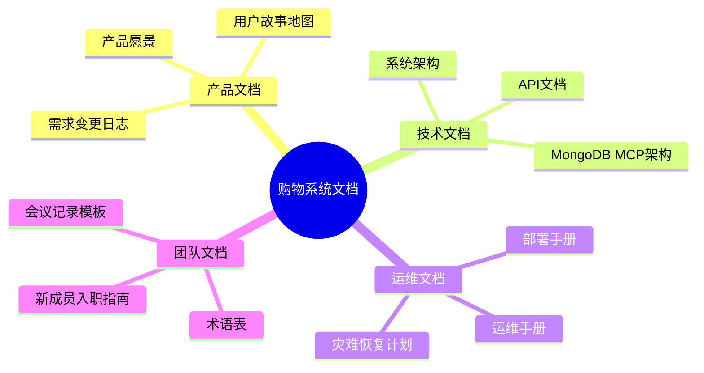

# 购物系统文档概览

本文档提供了购物系统所有文档的综合概述，帮助团队成员快速了解系统的各个方面，并指引如何获取详细信息。

## 1. 文档体系结构

购物系统采用全面的文档体系，涵盖从产品愿景到技术实现的各个方面。文档体系按以下类别组织：

## 2. 产品文档

### 2.1 [产品愿景](./product-vision.md)

产品愿景文档定义了购物系统的整体目标、价值主张和市场定位。关键内容包括：

- **产品目标**：创建现代化、高性能、用户友好的电子商务平台
- **核心功能**：用户认证、商品目录、购物车、订单管理等
- **成功指标**：用户增长率、转化率、平均订单价值等
- **产品路线图**：近期、中期和长期目标
- **技术愿景**：采用前沿技术栈，构建可扩展架构

### 2.2 [用户故事地图](./user-story-map.md)

用户故事地图文档详细描述了系统的用户角色、用户旅程和功能需求。主要内容包括：

- **用户角色**：消费者和管理员
- **用户旅程**：认证、商品浏览、购物车管理、结账支付、订单管理、商品管理
- **故事优先级**：使用优先级矩阵确定开发顺序
- **发布计划**：MVP、第二阶段和第三阶段发布内容

### 2.3 [需求变更日志](./change-log.md)

需求变更日志记录了系统开发过程中的需求调整。包含：

- **变更记录**：8项主要需求变更，包括添加、修改和删除的需求
- **变更分析**：变更类型和状态分布，对项目的总体影响
- **影响评估**：每项变更对系统设计、开发计划的影响

## 3. 技术文档

### 3.1 [系统架构](./system-architecture.md)

系统架构文档描述了购物系统的技术架构设计。核心内容包括：

- **整体架构**：基于Turborepo的微前端Monorepo架构
- **前端架构**：Next.js应用、UI组件库、状态管理
- **后端架构**：Express应用、中间件、数据访问层
- **技术栈**：前端、后端和DevOps技术详细说明
- **设计原则**：关注点分离、模块化、可扩展性
- **安全设计**：认证、授权、数据保护方案

### 3.2 [MongoDB MCP架构](./mongodb-mcp.md)

MongoDB MCP架构文档详细说明了系统的数据访问层设计。包括：

- **MCP模式**：Model-Controller-Provider架构概述
- **数据库连接管理**：连接建立、状态跟踪和关闭处理
- **通用仓库模式**：通用Repository实现和方法
- **专用仓库**：用户、产品、购物车和订单仓库的特定功能
- **错误处理**：统一的错误处理策略
- **未来扩展**：缓存层、数据验证、复杂查询等扩展计划

### 3.3 API文档

API文档详细描述了系统的RESTful API接口。主要内容包括：

- **认证API**：用户注册、登录、令牌刷新
- **商品API**：商品列表、详情、搜索、分类
- **购物车API**：添加、更新、移除商品
- **订单API**：创建、查询、更新订单状态
- **请求/响应示例**：每个API的示例请求和响应

## 4. 运维文档

### 4.1 [部署手册](./deployment-guide.md)

部署手册提供了系统从开发到生产环境的部署指南。关键内容包括：

- **部署架构**：前端、后端、数据库的部署架构
- **环境要求**：开发和生产环境的软件需求
- **部署流程**：本地开发、Vercel部署步骤
- **MongoDB Atlas配置**：数据库创建、访问设置
- **CI/CD配置**：GitHub Actions自动化部署
- **自定义域名**：域名配置和DNS设置
- **部署检查清单**：部署前后的验证项目

### 4.2 [运维手册](./operations-manual.md)

运维手册为系统管理员提供了日常运维指南。包含：

- **环境管理**：环境配置和变量管理
- **日常维护**：备份、监控、性能优化
- **故障处理**：常见问题诊断、恢复程序
- **安全维护**：更新、审计、权限管理
- **监控与报警**：监控系统、报警配置
- **容量规划**：资源需求评估、容量管理
- **日志管理**：日志收集、查询、保留策略
- **联系信息**：技术支持团队、紧急联系流程

### 4.3 灾难恢复计划

灾难恢复计划文档定义了系统灾难后的恢复策略。主要内容包括：

- **恢复目标**：RPO和RTO定义
- **灾难场景**：可能的灾难类型及影响评估
- **恢复策略**：不同灾难场景的恢复方案
- **恢复程序**：详细的恢复步骤和责任分配
- **测试计划**：灾难恢复测试的方法和频率

## 5. 团队文档

### 5.1 [术语表](./glossary.md)

术语表定义了系统中使用的专业术语和缩略语。包括：

- **技术术语**：API、JWT、MCP等技术概念
- **业务术语**：购物车、结账、订单等业务概念
- **缩略语对照表**：常用缩略语及其含义

### 5.2 新成员入职指南

新成员入职指南帮助新加入的团队成员快速熟悉项目。内容包括：

- **项目概述**：购物系统的背景和目标
- **技术栈**：前端、后端和工具链
- **开发环境**：环境搭建步骤
- **开发流程**：代码规范、提交流程、审查要求
- **团队沟通**：沟通工具和渠道
- **常见问题**：新成员常见问题解答

### 5.3 [会议记录模板](./meeting-minutes-template.md)

会议记录模板提供了标准化的会议记录格式。包含：

- **基本信息**：日期、时间、地点、类型
- **参会人员**：出席和缺席成员
- **议程项目**：讨论主题和时长
- **行动项目**：任务分配和截止日期
- **决策事项**：会议中做出的决策
- **后续步骤**：下一步行动计划

## 6. 文档维护

### 6.1 文档更新流程

所有文档都应遵循以下更新流程：

1. 识别需要更新的文档
2. 在Git仓库中创建新分支
3. 更新文档内容
4. 提交变更并创建Pull Request
5. 进行文档审查
6. 合并变更到主分支

### 6.2 文档版本控制

文档版本使用Git进行控制，每个文档头部应包含：

- 文档标题
- 最后更新日期
- 版本号
- 负责人

### 6.3 文档责任矩阵

| 文档类别 | 负责角色   | 审查角色   | 更新频率   |
| -------- | ---------- | ---------- | ---------- |
| 产品文档 | 产品经理   | 技术负责人 | 需求变更时 |
| 技术文档 | 技术负责人 | 高级开发者 | 架构变更时 |
| 运维文档 | 运维工程师 | 技术负责人 | 流程变更时 |
| 团队文档 | 项目经理   | 团队成员   | 季度审查   |

## 7. 如何使用文档

### 7.1 新团队成员

新加入的团队成员应按以下顺序阅读文档：

1. 产品愿景 - 了解产品目标和定位
2. 入职指南 - 熟悉开发环境和流程
3. 术语表 - 掌握项目术语
4. 系统架构 - 理解技术架构
5. 用户故事地图 - 熟悉功能需求

### 7.2 开发人员

开发人员在日常工作中可参考：

1. 用户故事地图 - 了解功能需求
2. 系统架构 - 理解技术设计
3. MongoDB MCP架构 - 数据访问层设计
4. API文档 - 接口定义和使用

### 7.3 运维人员

运维人员主要参考：

1. 部署手册 - 系统部署和配置
2. 运维手册 - 日常运维和故障处理
3. 灾难恢复计划 - 应对严重故障

## 8. 文档索引

| 文档名称        | 路径                                                           | 主要受众   | 核心用途             |
| --------------- | -------------------------------------------------------------- | ---------- | -------------------- |
| 产品愿景        | [./product-vision.md](./product-vision.md)                     | 所有人员   | 了解产品目标和方向   |
| 用户故事地图    | [./user-story-map.md](./user-story-map.md)                     | 产品、开发 | 了解功能需求和优先级 |
| 需求变更日志    | [./change-log.md](./change-log.md)                             | 产品、开发 | 跟踪需求变化         |
| 系统架构        | [./system-architecture.md](./system-architecture.md)           | 开发、运维 | 理解技术架构         |
| MongoDB MCP架构 | [./mongodb-mcp.md](./mongodb-mcp.md)                           | 开发       | 理解数据访问设计     |
| 部署手册        | [./deployment-guide.md](./deployment-guide.md)                 | 开发、运维 | 部署和配置系统       |
| 运维手册        | [./operations-manual.md](./operations-manual.md)               | 运维       | 日常维护和故障处理   |
| 术语表          | [./glossary.md](./glossary.md)                                 | 所有人员   | 理解专业术语         |
| 会议记录模板    | [./meeting-minutes-template.md](./meeting-minutes-template.md) | 所有人员   | 标准化会议记录       |
